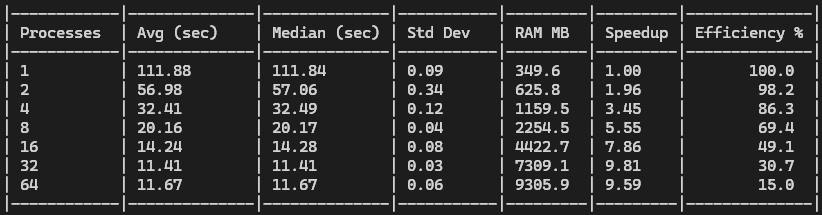

# python-pdfimgextract

## 🚀 python-pdfimgextract

A high-performance, parallel PDF image extractor built for speed and reliability.

---

## ✨ Features

* ⚡ **Parallel Extraction**: Fully utilizes multi-core processors for maximum throughput.
* 🛡️ **Atomic Writes**: Ensures file integrity by preventing partial or corrupted writes.
* 🧹 **Deduplication**: Automatically identifies and removes duplicate images.
* 💻 **Clean CLI**: Simple and intuitive command-line interface.
* 📊 **Progress Tracking**: Real-time visual feedback via a progress bar.
* 🛑 **Safe Interruption**: Handles signals gracefully to stop without leaving a mess.

---

## 📥 Installation

```bash
# Clone the repository
git clone https://github.com/your-username/python-pdfimgextract

# Navigate to the directory
cd python-pdfimgextract

# Install the package and dependencies
pip install .
```

---

## 🛠️ Usage

```bash
pdfimgextract [INPUT_PDF] [OUTPUT_DIR] [NUMBER_OF_PROCESSES]
```

Or use the optional flags:

* `--input` | `-i`
* `--output` | `-o`
* `--parallelism` | `-p`

> The default number of parallel processes is **8** if not specified.

---

## 📊 Performance, Scalability & Efficiency Analysis

**Performance Benchmark**
To evaluate the efficiency of the multiprocessing implementation, a stress test was conducted using a high-resolution PDF document.

💻 **Test Environment**:

* OS: Windows 11
* CPU: 28 Cores
* Input File: 491 MB PDF (514,956,001 bytes)
* Extracted images: 230 (ranging from ~2MB to 10MB each)

### 📈 Performance & Speedup ($S$) Analysis

The system demonstrates near-linear scaling at low process counts, followed by a plateau as hardware limits are reached.

* **Near-Perfect Scaling (1-2 Processes):** The transition from a single process to two shows an efficiency of **98.2%**, reducing execution time from 111.88s to 56.98s. This indicates minimal initial synchronization overhead.
* **Peak Throughput:** The maximum performance was achieved at **32 processes**, reaching a minimum execution time of **11.41s** with a recorded **Speedup of 9.81x**.
* **Hardware Saturation & Regression:** Beyond the peak, increasing the load to 64 processes resulted in a performance regression (11.67s). This is a textbook case of **CPU over-provisioning**, where the overhead of context switching and thread management outweighs the benefits of parallelization.

### 🔍 Efficiency ($E$) & Resource Utilization

Efficiency measures how effectively each additional CPU worker is utilized. As shown in the data, efficiency declines as the task becomes increasingly fragmented.



#### Key Technical Observations

* **Amdahl’s Law & I/O Bottlenecks:** The sharp drop in efficiency (from 86.3% at 4 processes to 15.0% at 64) suggests a significant serial fraction in the workload. While PDF decoding is CPU-bound, writing 230 high-resolution images to storage is **I/O-bound**. Once the disk write-buffer is saturated, additional CPU processes offer no further speedup.
* **Memory Footprint Scaling:** RAM consumption scales aggressively, jumping from **349.6 MB** (1 process) to over **9.3 GB** (64 processes). This represents a ~26x increase in memory overhead for only a ~9.6x gain in speed, highlighting the diminishing returns of high-concurrency configurations.
* **The Operational "Sweet Spot":** For this hardware configuration, the range between **8 and 16 processes** represents the ideal balance. It achieves a significant speedup (up to 7.86x) while maintaining a resource-to-performance ratio above 49% efficiency.
* **System Thrashing:** At 64 processes—well beyond the 28 physical cores—efficiency hits its lowest point. The OS spends a disproportionate amount of time swapping tasks ("thrashing") rather than performing productive computation.

---

## 🏆 Final Verdict Summary

The benchmarks demonstrate that **pdfimgextract** significantly reduces processing time through effective parallelization.

* Single-core: 114.3s
* Multi-core: 11.3s

> Represents a 10x performance increase.

### 🚀 Recommendation

For most high-resolution extraction tasks:

* **For Efficiency**: Use a process count equal to half of your available logical cores.
* **For Raw Speed**: Match the process count to your total physical cores ($N$).
* **Avoid Over-provisioning**: Setting processes beyond your hardware thread count (e.g., 64 on a 28-core system) will degrade performance due to I/O saturation and context switching.

### 🛠️ Key Takeaways

* Max Speedup: $10.12x$
* Peak Efficiency: 99% (at 2 processes)
* Optimal Range: 8 - 20 processes
