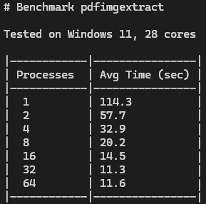
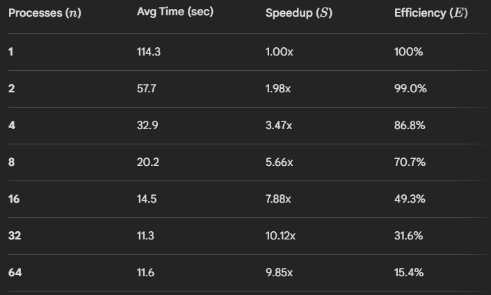

# python-pdfimgextract

A fast parallel PDF image extractor written in Python.

## Features

- parallel extraction
- atomic file writes
- duplicate image removal
- clean CLI interface
- progress bar
- safe interruption handling

## Installation

```bash
git clone this repo
cd python-pdfimgextract
pip install .
```

## Usage

```bash
pdfimgextract [INPUT_PDF] [OUTPUT_DIR] [NUMBER_OF_PROCESSES]
```

Or use the optional flags:

--input | -i  
--output | -o  
--parallelism | -p  

The default number of parallel processes is **8** if not specified.

## Benchmark

Performance Benchmark

To evaluate the efficiency of the multiprocessing implementation, a stress test was conducted using a high-resolution PDF document.

Test Environment:

OS: Windows 11

CPU: 28 Cores

Input File: 491 MB PDF (514,956,001 bytes)

Extracted result: 230 images (ranging from ~2MB to 10MB each)



Key Observations:
Scaling: Moving from 4 to 20 processes nearly doubled the extraction speed (1.93x faster).

Diminishing Returns: Between 20 and 40 processes, the performance gain was minimal (~1.3s), suggesting that the bottleneck shifts from CPU processing to Disk I/O or overhead management.

Sweet Spot: For this specific hardware (28 cores), 20 processes offered the best balance between performance and resource allocation.

## Efficiency

Efficiency Analysis

While Speedup **(S)** measures how much faster the task finishes, Efficiency **(E)** measures how effectively each additional process is being utilized. 
Based on our benchmarks, we observe a clear trend of diminishing returns as the process count increases.

Performance Data



Analysis: 

• Parallel Overhead: As the number of processes **(n)** increases, the overhead for process synchronization, inter-process communication (IPC), and task distribution begins to outweigh the computation gains.

• I/O Bottlenecks: Since image extraction is heavily dependent on Disk I/O, the hardware eventually reaches a "saturation point" where adding more CPU workers cannot speed up the rate at which data is written to the storage drive.

• The "Sweet Spot": For this hardware configuration, 20 processes represent the practical limit for scaling. Beyond this point, you are consuming 100% more CPU resources (moving from 20 to 40) for a marginal speed gain of only ~6.4%.